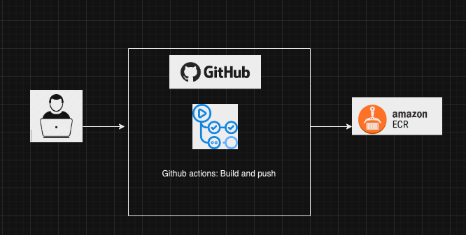
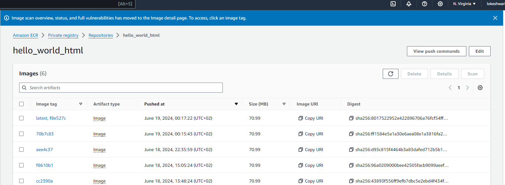

# Containerize Webapp

This repository represents the Continuous Integration (CI) part of a containerized web application. It utilizes GitHub Actions to build a Docker image and push it to Amazon Elastic Container Registry (ECR). The application is a simple HTML web app, and its CI workflow is defined in ecr_push.yml.

## Instructions to use the application

1. Clone the Repository: Clone this repository to your local machine.
2. Modify the Application: Make any required changes to index.html as needed for your application
3. Commit Your Changes: After making changes, commit them to the repository.
4. CI Workflow: When you push the changes to the repository, GitHub Actions will automatically trigger the CI workflow. This workflow will Build the Docker image and Push the Docker image to AWS ECR.

## Prerequisites

* AWS Account: You need an AWS account with permissions to push images to ECR.
* GitHub Secrets: Store the required credentials in GitHub Secrets:
* AWS_ACCESS_KEY_ID
* AWS_SECRET_ACCESS_KEY
* AWS_REGION
* ECR_REPOSITORY

## Architecture

## CI/CD Pipeline

The CI/CD pipeline is defined in the ecr_push.yml file. This workflow is triggered on every commit to the main branch. The steps involved in the pipeline are:

1. Checkout Code: Checks out the repository code.
2. Login to AWS ECR: Logs in to Amazon ECR using the stored GitHub Secrets.
3. Build Docker Image: Builds the Docker image from the Dockerfile.
4. Push Docker Image: Tags the built image and pushes it to the specified ECR repository.

## Conclusion

After successful run, you will be able to find the docker image in AWS ECR with latest tag

